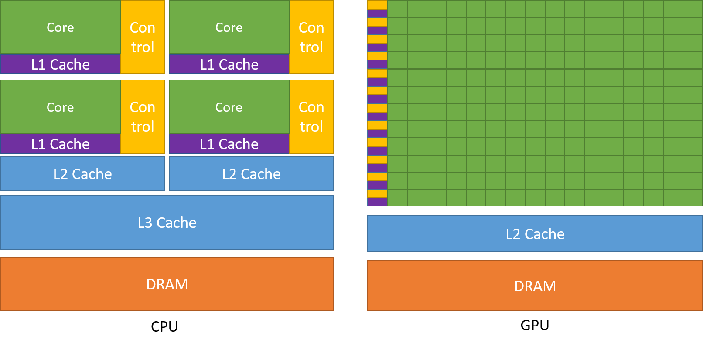

# Study Notes on CUDA Programming Guide

## 1. Introduction to CUDA
### 1.1 Introduction
*GPU vs CPU*


### 1.2 Programming Model
*Conceptual Model of GPU for CUDA


Shared Memory is per SM and it coexists with Unified Data Cache and Register File. It's managed by programmer. E.g:
```
__shared__ float tile[32][32];
```

*Thread Blocks and Grids


*Thread Block Scheduling"

There is no guarantee on Thread Block scheduling, so Thread Block cannot rely of results of other Thread Blocks.

With some exceptions, thread cannot rely on or syncrhonize with a thread from a different Thread Block of the same Grid.

Within a Thread Block, threads are organized in to groups of 32 threads called a Warp.

Threads of a Warp execute the same code, but may follow different branches. This paradigm is called Single Instruction Multiple Threads (SIMT).

Within a Warp, there are 32 execution unit.
All threads within a Warp execute the same code, when some threads enter a branch while others don't, others will be masked off while current branch is executing.

Threads within the Warp are executed instruction by instruction, that is, at the same, all threads execute the same intruction.

Threads Block is better to have a total number of threads which is a mutiple of 32 for best memory access and unit utilization.

GPU uses Virtual Memory Addressing and it shares the same address space with CPU

To schedule a thread block to an SM, the number of available registers much be greater than or equal to the number of registers needed by each thread times total number of threads of that thread block.

### 1.3 The CUDA Platform
Every NVIDIA GPU has a Compute Capability (CC) number, which indicates what features are supported by that GPU and specifies some hardware parameters for that GPU.

Compute capability is denoted as a major and minor version number in the format X.Y where X is the major version number and Y is the minor version number.


